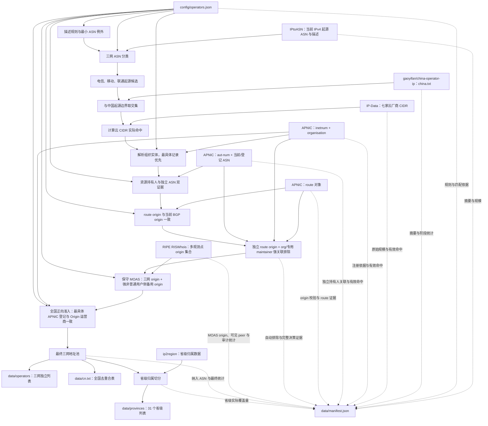

# 中国三网普通互联网接入用户侧公网 IPv4 候选列表

本仓库自动维护上述候选列表，明确用于 ACL 白名单。`dev` 分支当前试验全国正向准入：除要求当前 BGP Origin 属于中国电信、中国移动或中国联通外，APNIC 最具体 `inetnum` 登记还必须能明确归属于同一家运营商。

该试验采取严格口径：登记给独立主体、归属不明、无登记或登记运营商与 Origin 不一致的地址不予准入；同时继续执行专用精品骨干、云厂商 CIDR、明确非普通用户侧用途、独立资源持有人、独立 route origin 和强 MOAS 证据排除。规则不枚举省、市或县级分支名称，所有地区使用完全相同的全国规则。它优先降低误收，不承诺穷尽中国三网普通互联网用户侧地址。

仓库输出三网独立列表、全国合表及 31 个省级行政区合表，供 ACL 系统按 CIDR 加载为允许来源。使用方应根据自身安全边界决定是否叠加更严格的策略，不应把本列表解释为对任一地址实际业务用途的保证。

## 项目流程

`ip2region` 只对最终地址池进行省级归属，不参与全国三网地址的纳入或排除判断；无法归属省份的地址仍保留在全国表和相应运营商表中。

## 数据文件

| 文件 | 内容 |
| --- | --- |
| `data/operators/chinanet.txt` | 中国电信 IPv4 CIDR |
| `data/operators/cmcc.txt` | 中国移动 IPv4 CIDR |
| `data/operators/unicom.txt` | 中国联通 IPv4 CIDR |
| `data/cn.txt` | 中国电信、中国移动和中国联通的 IPv4 CIDR 去重合表 |
| `data/provinces/<pinyin>.txt` | 相应省级行政区内上述运营商的 IPv4 CIDR 去重合表 |
| `data/manifest.json` | 本次生成时间、上游文件大小与摘要、各筛选阶段统计、云 CIDR、APNIC inetnum/aut-num/route 和 RIPE RIS MOAS 的实际命中、三网 ASN 汇总、最终纳入和排除的 ASN/前缀、匹配依据，以及每个列表文件的统计信息 |
| `config/operators.json` | 全国通用的运营商名称规则、强制收录 ASN 和排除 ASN；不得包含按省、市或县单独生效的准入规则 |

省级文件以拼音命名，例如 `beijing.txt`、`guangdong.txt`、`shaanxi.txt`、`xinjiang.txt`。每个文本文件一行一个 CIDR，按地址排序，且文件内部不存在重叠网段。

## 生成规则

- 运营商候选采用 [IPtoASN](https://iptoasn.com/) 按小时更新的 IPv4 BGP 起源 ASN 数据，根据中国电信、中国移动和中国联通的 ASN 名称筛选，并显式排除名称碰撞但不属于三家运营商的 ASN；仅保留同时出现在 [gaoyifan/china-operator-ip](https://github.com/gaoyifan/china-operator-ip/tree/ip-lists) `ip-lists` 分支 `china.txt`（起源 ASN 为中国 ASN）的地址，以排除异常路由与非中国起源地址。
- 全国正向准入在既有排除之后执行：每个运营商候选地址必须由 APNIC 最具体 `inetnum` 的全国通用名称规则识别为同一家运营商。独立主体、归属不明、无登记以及运营商冲突范围均不进入 `cn.txt`、三网独立列表或任何省级列表。配置不得通过枚举地方分支名称提高单一地区召回率。
- 运营商匹配规则统一维护在 `config/operators.json`。`include_asns` 补充名称无法识别的三网 ASN；`exclude_description_rules` 自动识别用途明确、超出普通互联网用户侧范围的 ASN；`exclude_asns` 只处理有明确证据、无法由通用描述规则可靠表达的例外。AS4809（中国电信 CN2）和 AS9929（中国联通 CUII）按专用精品骨干显式排除；普通用户地址的 AS Path 即使经过二者也不受影响，因为构建器只按 Origin ASN 判定。manifest 会区分 `description_rule` 和 `explicit_policy` 两类排除来源。
- 云厂商前缀排除暂采用 [axpwx/IP-Data](https://github.com/axpwx/IP-Data) 的阿里云、腾讯云、华为云、UCloud、金山云、百度智能云和京东云独立 IPv4 CIDR 文件，不使用其宽泛 `all-cidr` 集合。云清单只有与三网候选地址实际相交的部分会影响结果；各来源的原始规模、有效命中规模和命中的 ASN/CIDR 都写入 manifest，便于持续审计上游质量。
- 混合运营商 ASN 内部的前缀级排除采用 APNIC WHOIS 的 [`inetnum`](https://ftp.apnic.net/apnic/whois/apnic.db.inetnum.gz)、[`organisation`](https://ftp.apnic.net/apnic/whois/apnic.db.organisation.gz) 和 [`route`](https://ftp.apnic.net/apnic/whois/apnic.db.route.gz) 对象。构建器仍扫描并统计完整上游，但只有与云清洗后三网候选范围相交的 inetnum/route 对象会进入组织关联、最具体记录解析和规则判断；任何能够影响候选地址的登记对象都必然与候选范围相交，因此该预过滤不改变地址判断。manifest 同时记录全量及实际参与计算的对象数。`inetnum` 的 `org` handle 会解析为结构化 `org-name`；重叠范围按最具体记录优先。`route` 证据只有在其 `origin` 与 IPtoASN 当前 BGP 起源 ASN 一致时才生效，避免陈旧 IRR 对象直接造成误删。只匹配用途明确的强特征：IDC/data center、hosting/colocation、21Vianet/CNISP、cloud computing/service/data、CDN、VPS/服务器托管、私有专线/专用电路、MPLS/VPN、IoT/M2M、电子政务专网、安全/DDoS、OA 系统、监控专网及 CCTV 媒体/机构网络；明确云品牌组合、AWS 中国运营方 Sinnet/光环新网与 WestCloudData/NWCD，以及经审计的完整企业实体名称也会触发。单独出现 Huawei、Baidu、Alibaba、`cloud`、`netbar`、`DIA`、`dedicated internet access`，以及设备、宽带或接入系统标签不会触发。
- 独立资源持有人以及登记给可关联独立 ASN 主体的三网 origin 前缀采用 APNIC [`aut-num`](https://ftp.apnic.net/apnic/whois/apnic.db.aut-num.gz) 自动交叉验证。最具体 inetnum 为 `ALLOCATED/ASSIGNED PORTABLE` 或 `ALLOCATED/ASSIGNED NON-PORTABLE`、登记主体自身不能识别为三网，并能通过相同 `org` handle 或长度不少于五字符的精确 `netname == as-name` 连接到 IPtoASN 当前仍活跃的非三网 ASN 时，按该登记前缀排除。若关联 ASN 当前不活跃，则还必须从 inetnum 的 `descr` 或 organisation 名称识别出完整法定主体名称，形成第二项独立证据；单独的企业词、netname、历史 ASN 或模糊名称不会触发。
- APNIC route 独立 origin 强关联用于处理当前由三网 ASN 宣告、但 route 对象指向活跃非三网 ASN 的前缀：inetnum、route、aut-num 三者必须共享同一 `org` handle，或共享只归属于该 ASN 的专用 maintainer。公共 maintainer 会因关联多个活跃 ASN 自动失效。满足条件的前缀自动排除，同时将完整登记证据写入 manifest 的 `apnic_route_origin_audit`；该段以 `enforced: true` 明确表示审计结论已参与最终 CIDR 删除。
- [RIPE RISWhois](https://ris.ripe.net/docs/ris-whois/) 提供多个 RIS 采集点汇总的当前前缀/origin 与可见 peer 数。这里只处理三网候选范围，并按最具体 BGP 前缀判断：当前三网 origin 和备用 origin 均须至少被 10 个 peer、且达到该前缀最高可见度的 5%；备用 origin 的当前 IPtoASN 描述还必须命中同一套强非普通用户侧规则，才会剔除。普通 MOAS、低可见度 origin、描述未知或证据含糊的情况只计入审计统计并继续保留。
- 省级归属采用 [lionsoul2014/ip2region](https://github.com/lionsoul2014/ip2region) IPv4 源数据；构建器先按省份合并其有序区间，再与三个运营商最终地址池求交。它只用于地域切分，不参与运营商判定。
- 仅处理 IPv4 和中国大陆 31 个省级行政区；非中国大陆地址及无法归入省级行政区的网段不进入省级文件。
- 相邻或重叠网段会合并为最大 CIDR 集合。三个运营商文件互不重叠且其并集严格等于 `cn.txt`；31 个省级文件互不重叠且均为 `cn.txt` 的子集。由于 ip2region 可能没有覆盖全国表中的全部地址，省级并集不强制等于全国表，实际归属覆盖量会作为 `province_attributed_output` 阶段写入 manifest。生成后校验器会检查这些关系、上游包含关系、排除证据和 manifest 文件摘要。

## 全国正向准入试验与浙江抽样审计

正向准入直接作用于全国地址池，省级文件只是全国最终结果与 `ip2region` 地域范围的交集，不存在浙江专用准入逻辑。manifest 的 `pre_operator_registration_admission`、`operator_registration_denials` 和 `operator_registration_admissions` 阶段记录全国试验规模。

[`data/audits/zhejiang-apnic.md`](data/audits/zhejiang-apnic.md) 继续作为可人工阅读的地区抽样审计，给出浙江准入前候选、全国规则造成的拒绝、最终保留量及证据样本；它不包含任何浙江专用分类规则。校验器会独立重算全国 `cn.txt` 和三网列表，并检查浙江最终样本只能包含 `operator_registration` 分类。

## 自动更新

[GitHub Actions](.github/workflows/update.yml) 每天 UTC 08:08 执行，也可从 Actions 页面手动运行。

仓库固定使用 `dev` 作为唯一开发分支，所有代码、规则、文档和工作流修改均先进入 `dev`；`main` 仅用于正式版本。推送非 `data/` 变更到 `dev` 会自动运行完整构建，Action 回写的纯数据提交不会重复触发工作流。

工作流在 runner 工作区下的临时目录下载上游数据，拒绝空文件或异常小的 APNIC/RIS 数据，执行 Go 编译检查和静态检查，生成 `data/` 并逐条校验来源、阶段统计和排除依据；仅当列表内容、上游来源或统计信息变化时提交更新。上游源文件不会被提交到仓库，runner 结束后即被销毁。
