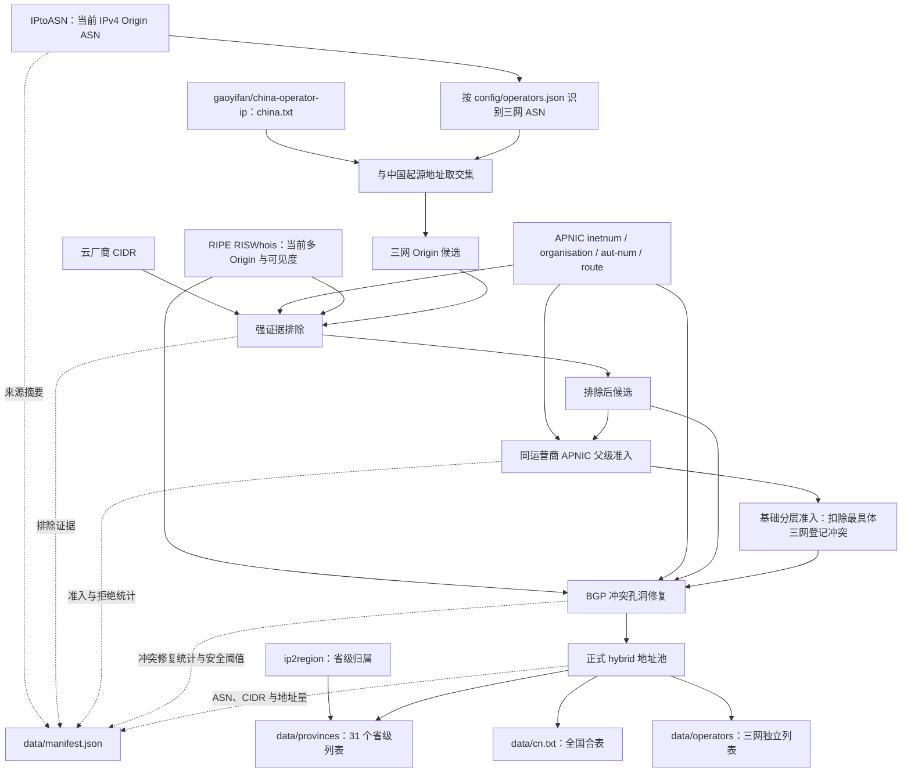

# 中国三网普通互联网接入用户侧公网 IPv4 候选列表

本仓库自动维护中国电信、中国移动和中国联通普通互联网接入网络中，用户访问公网时可能对外呈现的 IPv4 地址，供 ACL 系统作为允许来源加载。

这是一个 **best-effort 候选列表**，不是地址实际用途的保证。生成器先要求当前 BGP Origin 属于三网并具有同运营商 APNIC 父级登记，再以强证据排除可识别的云、IDC、托管、专网和独立资源；最后只在严格边界内，以当前 BGP 宣告单元修复三网内部登记冲突造成的细碎孔洞。

## 范围

| 范围 | 处理 |
| --- | --- |
| 三网普通互联网接入网络的用户侧公网地址 | 目标地址，满足准入条件后保留 |
| 云计算、IDC、托管、CDN、VPS 和服务器业务 | 有可靠 ASN、CIDR 或 APNIC 证据时排除 |
| 企业办公出口、企业宽带或互联网专线、企业 NAT 和固定企业地址 | 非目标；有可靠证据时排除 |
| 学校、酒店、商场、园区及其他机构的统一上网出口 | 非目标；有可靠证据时排除 |
| 政务、行业专网、VPN/MPLS、IoT/M2M、OA、监控等专用网络 | 有明确用途登记时排除 |
| CN2、CUII 等专用精品骨干 | 按 Origin ASN 显式排除；普通用户路由路径经过这些骨干不受影响 |
| 无法形成可靠证据的混合用途或代宣告地址 | 保留并承认 best-effort 误差 |

本项目不通过维护全国省、市、县分支名称白名单来提高召回率，也不逐个追踪无法自动验证的客户地址。使用方应按自身安全边界决定是否叠加更严格的策略。

## 工作流程

### 1. 三网 Origin 候选

- [IPtoASN](https://iptoasn.com/) 提供当前 IPv4 BGP Origin ASN 和 ASN 描述。
- `config/operators.json` 使用全国通用名称规则识别中国电信、中国移动和中国联通；每家运营商的 `include_asns` 只补充名称无法可靠识别的 ASN。
- `exclude_description_rules` 自动排除用途明确且超出普通用户侧范围的 ASN；`exclude_asns` 只保留无法由通用描述规则安全表达的最小例外。
- AS4809（中国电信 CN2）和 AS9929（中国联通 CUII）按专用精品骨干显式排除。构建器只判断 Origin ASN，不会因为普通用户地址的 AS Path 经过二者而删除该地址。
- 候选地址必须同时位于 [gaoyifan/china-operator-ip](https://github.com/gaoyifan/china-operator-ip/tree/ip-lists) `ip-lists` 分支的 `china.txt` 内，用于限制中国起源边界。

### 2. 强证据排除

所有强排除都先于 hybrid 准入执行，后续冲突修复不得将其放回。

- 云厂商 CIDR 使用 [axpwx/IP-Data](https://github.com/axpwx/IP-Data) 的阿里云、腾讯云、华为云、UCloud、金山云、百度智能云和京东云独立 IPv4 文件，不使用其宽泛的 `all-cidr`。只有与三网候选实际相交的部分影响结果。
- APNIC 前缀证据来自 [`inetnum`](https://ftp.apnic.net/apnic/whois/apnic.db.inetnum.gz)、[`organisation`](https://ftp.apnic.net/apnic/whois/apnic.db.organisation.gz)、[`aut-num`](https://ftp.apnic.net/apnic/whois/apnic.db.aut-num.gz) 和 [`route`](https://ftp.apnic.net/apnic/whois/apnic.db.route.gz)。重叠 `inetnum` 按最具体记录解析，`org` handle 会关联到结构化组织名称。
- 用途规则只匹配明确强特征，例如 IDC/data center、hosting/colocation、云计算服务、CDN、VPS/服务器托管、专线/专用电路、VPN/MPLS、IoT/M2M、电子政务、安全/DDoS、OA、监控，以及经审计的完整云、IDC 或独立主体名称。单独出现 Huawei、Baidu、Alibaba、`cloud`、`netbar`、`DIA`、设备或接入系统标签不会触发。
- portable、delegated 和独立法定主体资源必须通过 APNIC 登记与活跃独立 ASN 的 `org`、精确 `netname == as-name` 或完整法定主体等强关联验证，不能仅凭普通企业名称删除。
- 同 Origin 的 APNIC `route` 用于验证登记用途；当 APNIC route Origin 与当前三网 Origin 不同，只有 inetnum、route、aut-num 共享同一 `org` 或专属于该独立 ASN 的 maintainer 时才自动排除。公共 maintainer 会因关联多个活跃 ASN 而失效，完整证据写入 manifest 的 `apnic_route_origin_audit`。
- [RIPE RISWhois](https://ris.ripe.net/docs/ris-whois/) 的强 MOAS 排除要求当前三网 Origin 和备用 Origin 均至少被 10 个 peer 观测，且各自达到该前缀最高可见度的 5%；备用 Origin 的当前 ASN 描述还必须命中强非目标规则。其余 MOAS 保留。

### 3. APNIC 父级准入

强排除后的每个地址必须具有由全国通用规则识别为同一家运营商的 APNIC 覆盖 `inetnum`。缺少同运营商父级登记的独立资源不会进入正式列表。

在此父级内，基础分层准入仍会按 APNIC 最具体登记扣除三网之间的运营商冲突。最具体登记不是直接证明实际业务用途；它只形成保守基线及可审计的冲突范围。

### 4. BGP 冲突孔洞修复

正式模式为 `hybrid_bgp_conflict_healing_with_strong_exclusions`。只有同时满足以下条件的地址，才能从三网登记冲突范围恢复：

1. 位于强排除后的三网 Origin 候选内；
2. 当前被 RIS 观测为同一家运营商的 BGP Origin；
3. 完整 BGP 宣告单元具有同运营商 APNIC 父级登记；
4. 确实属于三网之间的最具体登记冲突；
5. 不与云、APNIC 用途、独立资源/route Origin 或强 MOAS 排除重叠。

生成器和独立校验器同时强制：hybrid 不得删除基础分层准入地址，修复地址不得超过基础分层地址量的 `0.1%`，最终 CIDR 数不得超过基础分层的 `1.10` 倍，且最终 CIDR 数不得超过父级准入前候选的 `2.0` 倍。仓库只生成正式 hybrid 结果，不保留其他准入策略的试验列表或对照报告。

### 5. 聚合与省级切分

- 最终地址按运营商分别聚合为最大 CIDR，三网列表互不重叠，其并集严格等于 `data/cn.txt`。
- [lionsoul2014/ip2region](https://github.com/lionsoul2014/ip2region) 只用于把最终地址池切分为中国大陆 31 个省级列表，不参与全国地址的纳入或排除。
- 无法被 ip2region 归属到省份的地址仍保留在全国表和运营商表，因此省级文件并集不强制等于全国表。

## 数据文件

| 文件 | 内容 |
| --- | --- |
| `data/operators/chinanet.txt` | 中国电信正式 IPv4 CIDR |
| `data/operators/cmcc.txt` | 中国移动正式 IPv4 CIDR |
| `data/operators/unicom.txt` | 中国联通正式 IPv4 CIDR |
| `data/cn.txt` | 三网地址的去重合表 |
| `data/provinces/<pinyin>.txt` | 相应省级行政区内的三网地址合表 |
| `data/manifest.json` | 上游摘要、各阶段统计、hybrid 阈值、纳入/排除 ASN、前缀级排除证据及输出文件摘要 |
| `data/audits/zhejiang-apnic.md` | 浙江正式结果的可读 APNIC 抽样审计 |
| `data/audits/zhejiang-apnic.json.gz` | 上述审计的完整机器可读事实 |
| `config/operators.json` | 全国通用的三网识别、ASN 例外和强排除规则 |

省级文件使用拼音命名，例如 `beijing.txt`、`guangdong.txt`、`shaanxi.txt` 和 `xinjiang.txt`。所有文本文件每行一个 CIDR，按地址排序且内部无重叠。

## Manifest 与审计

`data/manifest.json` 是每次生成的事实清单，记录：

- 本次生成时间，以及所有上游的 URL、文件大小和 SHA-256；
- 从 Origin 候选、中国边界、各类强排除、父级准入、hybrid 修复到最终输出的地址量和 CIDR 数；
- 三网纳入 ASN 汇总及显式/描述规则排除的 ASN；
- 每个实际生效的云、APNIC、独立 route Origin 和强 MOAS 前缀及其证据；
- hybrid 修复地址量、CIDR 变化和全部安全阈值；
- 全国、运营商、省级列表及审计文件的摘要。

浙江审计只用于检查全国正式规则在一个小范围内的表现，不包含任何浙江专用准入或排除规则。校验器会独立重算全国表、三网表、各阶段统计和 manifest 证据，并要求正式结果不与已启用的强排除范围重叠。

## 自动更新

[GitHub Actions](.github/workflows/update.yml) 每天 UTC 08:08 运行，也支持手动触发。

仓库固定使用 `dev` 作为唯一开发分支：代码、规则、文档和工作流修改先进入 `dev`，`main` 只接收经过验证的正式版本。推送非 `data/` 变更到 `dev` 会触发完整流程；Action 回写的纯数据提交因 `paths-ignore: data/**` 不会递归触发。

工作流依次执行：

1. 下载全部上游到 runner 临时目录；
2. 拒绝空文件以及异常小的 APNIC/RIS 数据；
3. 运行 `go test ./...` 和 `go vet ./...`；
4. 生成正式列表、manifest 和浙江审计；
5. 使用独立校验器重算并核验所有关系、阈值和摘要；
6. 仅在 `data/` 实际变化时由 GitHub Actions 提交结果。

Go 模块缓存由 `actions/setup-go` 管理；上游原始文件不进入仓库，runner 结束后销毁。
